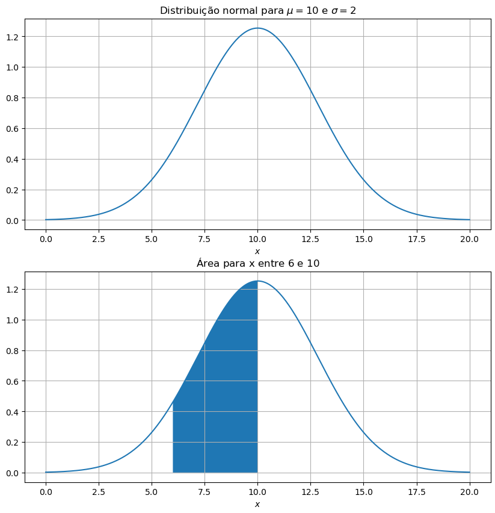
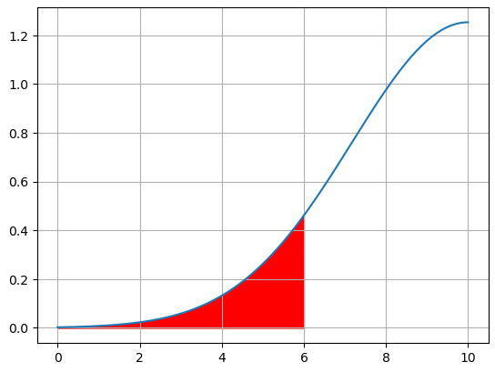
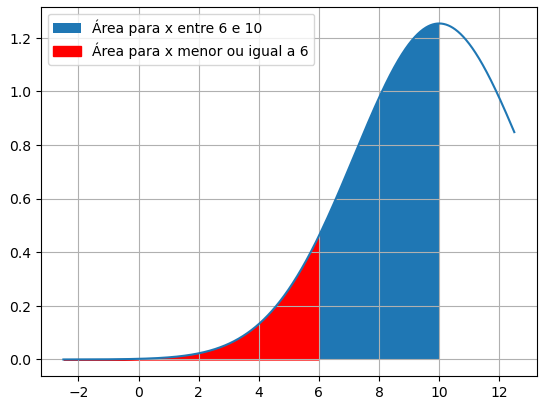
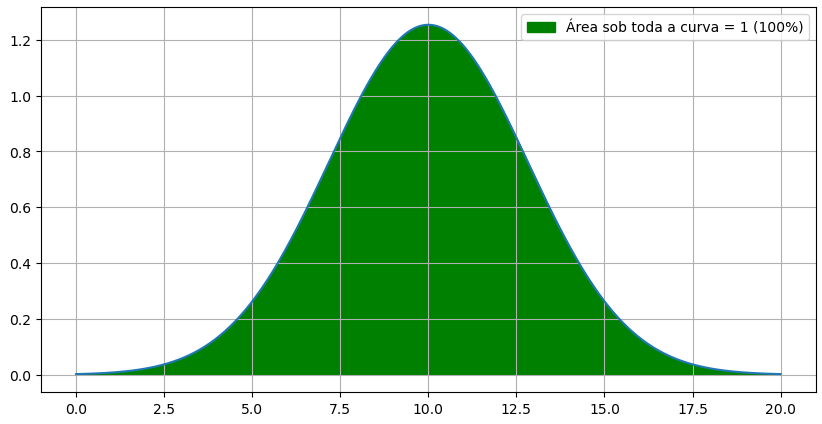
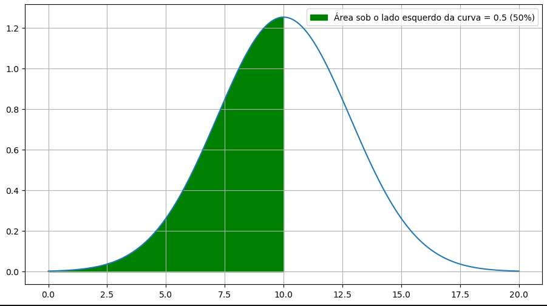
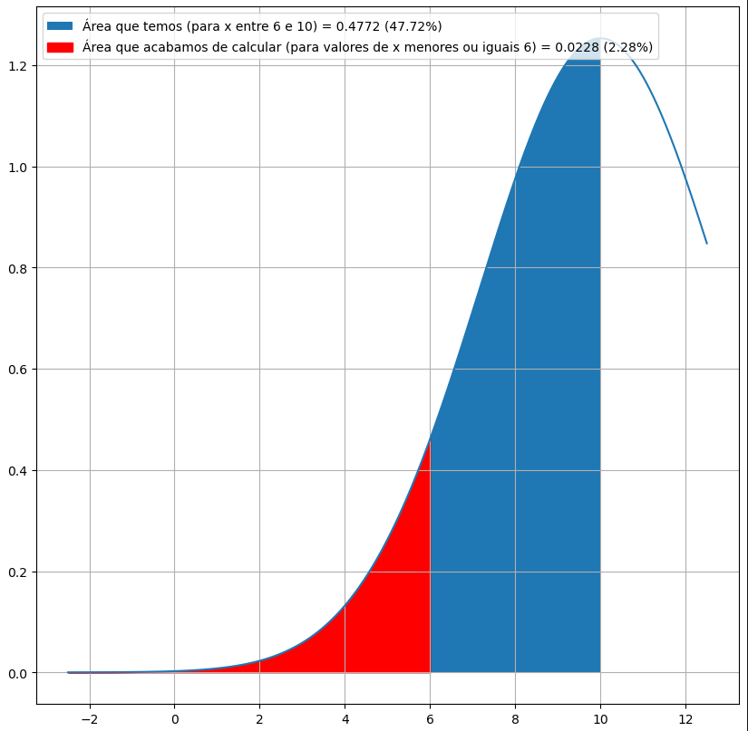

# Lista de Exercícios 2 (II Unidade)

**(Distribuição Normal e T de Student)**

(a) Calcule as probabilidades de haver restituição nos televisores do tipo A e do tipo B.

Primeiramente organizamos as informações dos tipos de televisores:

$
\text{tipo A (comum)} =
\begin{cases}
\mu \text{(média)}            & = 10 \\
\sigma \text{(desvio padrão)} & = 2
\end{cases}
$

$
\text{tipo B (luxo)} =
\begin{cases}
\mu    & = 11 \\
\sigma & = 3
\end{cases}
$

A partir da média e do desvio padrão, podemos definir o Z-Score de cada tipo de televisor.\
Sendo a equação do Z-Score:

$ \boxed{Z = \frac{x - \mu}{\sigma}} $.

Temos, para o tipo A, o Z-Score definido como:

$ \boxed{Z_{A} = \frac{x - 10}{2}} $.

E para o tipo B:

$ \boxed{Z_{B} = \frac{x - 11}{3}} $.

Com o Z-Score dos tipos definidos, podemos agora calcular as probabilidades de haver restituição de cada tipo de televisor.\
Como a garantia de restituição ocorre caso algum televisor apresentar defeito no prazo de seis meses, podemos interpretar da seguinte maneira:

$ \text{Se algum defeito grave ocorrer em até 6 meses, ocorre restituição.} $

Queremos portanto a probabilidade de ocorrer algum defeito em até 6 meses (ou seja, de 6 meses pra baixo).\
Matematicamente, sendo $x$ a **probabilidade de ocorrer algum defeito**, escrevemos como:

$
\boxed{P (x \leq 6)} \\
\text{x menor ou igual à 6 (meses)}
$.

Substituimos então $x$ nas equações de Z-Score:

$
Z_{A} = \frac{6 - 10}{2} = -4 / 2 \\
\boxed{Z_{A} = -2}
$.

Consultando a **tabela da distribuição normal unicaudal**, temos para o Z-Score $2$ o valor $0.4772$.

$
Z_{B} = \frac{6 - 11}{3} = -5 / 3 \\
\boxed{Z_{B} = -1.67}
$.

Consultando a tabela, temos para o Z-Score $1.67$ o valor $0,4525$.

A partir dessas informações, partimos agora para a análise do gráfico da distribuição normal.

Começando para os **televisores do tipo A**:

O exercício pede a probabilidade de ocorrer restituição em **até 6 meses**, ou seja, no gráfico, estamos falando de valores **de 6 pra baixo**:

portanto a situação atual é:

com o Z-Score calculamos a área do gráfico **entre 6 e 10**, mas para encontrarmos a probabilidade de ocorrer restituição em até 6 meses, precisamos da **área do gráfico abaixo de 6**.

Para encontrarmos a área vermelha (valores de x menores ou iguais a 6), precisaremos utilizar de algumas propriedades do gráfico da distribuição normal.

**A área total sob a curva vale 1**.

Ou seja, toda a área do gráfico da distribuição normal vale 1 (se $x$ são as possibilidades, para todos os $x$ teríamos $100\%$ de possibilidades).

**A curva é simétrica em torno de $x = média$**.

Como a área sob toda a curva vale 1 (100%), se dividirmos a área no centro exato do gráfico, teremos exatamente 0.5 (50%) da área no lado esquerdo, e 0.5 (50%) da área no lado direito.

Voltando para a questão inicial, temos a área para x entre 6 e 10 ($0.4772 = 47.72\%$).

Se a área do lado esquerdo do gráfico é 0.5 ($50\%$), temos portanto:

$ \text{Área que não temos (para x menor ou igual a 6)} + \text{Área que temos (para x entre 6 e 10 = 0.4772)} = 0.5 (50\% \text{ da área}) $

Logo

$
\text{Área que não temos} + 0.4772 = 0.5 \\
\text{Área que não temos} = 0.5 - 0.4772 \\
\text{Área que não temos} = 0,0228
$

Ou seja, a área para valores de $x$ menores ou iguais $6$ é $0.0228$ ($2.28\%$).

**Recapitulando:**

O tempo para ocorrência de algum defeito grave nos televisores do tipo A (normal) tem média de 10 meses e desvio padrão de 2 meses.\
Portanto o Z-Score para o tipo A:

$ \boxed{Z_{A} = \frac{x - 10}{2}} $

Se ocorrer algum defeito em até 6 meses, ocorre também restituição da quantia paga.\
O exercício pede para calcularmos a probabilidade de restituição de cada tipo de televisor, queremos portanto a probabilidade de ocorrer algum defeito grave em até 6 meses:

$ \boxed{P (x \leq 6)}$.

$
Z_{A} = \frac{6 - 10}{2} \\
Z_{A} = -4 / 2 \\
\boxed{Z_{A} = -2}
$

Na tabela, um Z-Score de $2$ tem o valor $0.4772$, portanto essa é a área que temos entre 6 e 10 ($47.72\%$).

Se a área do lado esquerdo do gráfico equivale a $0.5 (50\%)$ da área total, temos essa equação:

$ \text{Área que não temos (para x menor ou igual a 6)} + \text{Área que temos (para x entre 6 e 10 = 0.4772)} = 0.5 (50\%) $

$
\text{Área que não temos} + 0.4772 = 0.5 \\
\text{Área que não temos} = 0.5 - 0.4772 \\
\text{Área que não temos} = 0.0228
$

Portanto, a probabilidade de ocorrer algum defeito grave em até 6 meses é:

$ \boxed{P(x \leq 6) = 0.0228 (2.28\%)} $

$ \boxed{\text{A probabilidade de ocorrer algum defeito grave em até 6 meses para os televisores do tipo A (normal), e consequentemente ocorrer restituição, é de 2.28\%.}} $

Para os televisores do tipo B (luxo), simplesmente **repetimos o exato mesmo processo**.

$ \boxed{P (x \leq 6)}$.

$
Z_{B} = \frac{6 - 11}{3} \\
Z_{B} = -5 / 3 \\
\boxed{Z_{B} = -1.67}
$

Na tabela, um Z-Score de $1.67$ tem o valor $0,4525$, portanto essa é a área que temos entre 6 e 10 ($45.25\%$).

Se a área do lado esquerdo do gráfico equivale a $0.5 (50\%)$ da área total, temos essa equação:

$ \text{Área que não temos (para x menor ou igual a 6)} + \text{Área que temos (para x entre 6 e 10 = 0.4525)} = 0.5 (50\%) $

$
\text{Área que não temos} + 0.4525 = 0.5 \\
\text{Área que não temos} = 0.5 - 0.4525 \\
\text{Área que não temos} = 0.0475
$

Portanto, a probabilidade de ocorrer algum defeito grave em até 6 meses é:

$ \boxed{P(x \leq 6) = 0.0475 (4.75\%)} $

$ \boxed{\text{A probabilidade de ocorrer algum defeito grave em até 6 meses para os televisores do tipo B (luxo), e consequentemente ocorrer restituição, é de 4.75\%.}} $